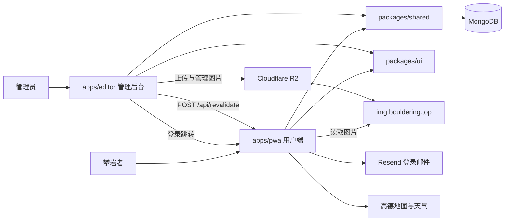
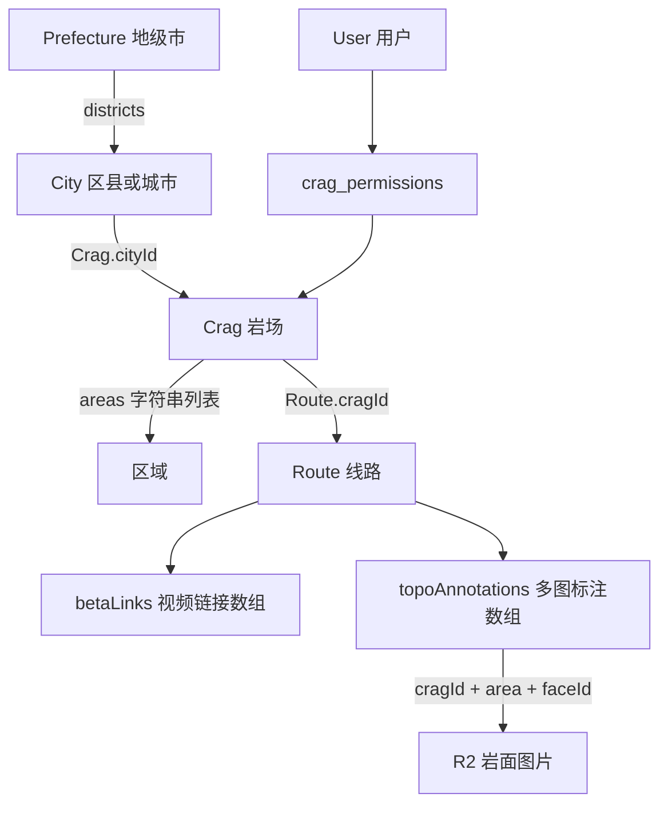

# 技术架构

> 核对日期：2026-09-20。描述当前仓库实现，不推断生产部署状态。阅读入口：[README](../README.md)。

## 1. 应用边界

BlocTop 是 pnpm + Turborepo monorepo，包含两个独立的 Next.js App Router 应用和两个源码共享包。



两个应用都包含服务端代码：Server Components、Route Handlers、认证实例。PWA 不通过 Editor 获取公开数据，Editor 也不通过 PWA 写业务数据库。跨应用 HTTP 调用主要用于登录跳转和缓存重验证。

| Workspace | 职责与依赖边界 |
| --- | --- |
| `@bloctop/pwa` | 三语路由、浏览/账号/离线体验、公开与用户 API；目前仍保留部分管理 API |
| `@bloctop/editor` | 中文后台、内容维护、权限管理、独立 API 与动态页面保护 |
| `@bloctop/shared` | 类型、数据访问、鉴权工厂、权限查询、纯工具、日志；含服务端模块，并非全部浏览器安全 |
| `@bloctop/ui` | React UI、IME 输入、Drawer、图片查看器、FaceImageCache、主题 CSS |

共享包直接导出 TypeScript 源码，没有独立构建脚本。Editor 的 Next 配置显式 `transpilePackages`；PWA 有部分 `@/lib/*` 和 `@/types` 文件仅转发共享包。新增依赖前区分客户端工具与 `db`、`mongodb`、权限查询等服务端模块。

## 2. 页面与 API 组织

PWA 页面在 `apps/pwa/src/app/[locale]/`，支持 `zh`、`en`、`fr`；路由入口是 `src/proxy.ts`，不是旧文档中的 `middleware.ts`。

主要页面：`/[locale]`、`/crag/[id]`、`/route`、`/profile`、`/login`、`/auth/*`、`/offline/*`（后几项均省略 locale 前缀）。在线线路详情主要通过抽屉展示；当前没有在线 `/[locale]/route/[id]/page.tsx`，离线端有单线路页面。

Editor 页面直接位于 `apps/editor/src/app/`：`/`、`/crags`、`/crags/[id]`、`/faces`、`/routes`、`/cities`、`/users`。无 locale 前缀，也没有 `/editor` 前缀。Beta 已合并进 `/routes` 的标签页，不再有独立 `/betas` 页面。当前工作区另有尚未提交的 `/crags/new`，见[后台指南](ADMIN.md)。

两端 `src/app/api/` 存在同名路由实现，不能把同一路径视为同一份 API。后台 API 清单及差异见[后台指南](ADMIN.md)。

## 3. 数据模型

类型以 [packages/shared/src/types/index.ts](../packages/shared/src/types/index.ts) 为准，持久化主要由 [db/index.ts](../packages/shared/src/db/index.ts) 和各 API 中的直接 MongoDB 操作完成。不是所有写入都经过统一数据访问函数。



| 实体/集合 | 关键约定 |
| --- | --- |
| `cities` / `prefectures` | 配置存在 MongoDB；地级市包含 `districts`、`defaultDistrict`，城市含 `adcode`、`available`、坐标 |
| `crags` | 字符串业务 ID；`cityId`、区域名称数组、坐标、接近路线、封面、致谢、`createdBy` |
| `routes` | 数字业务 ID；归属岩场和区域，难度通常为 V 级；内嵌 Beta 与多图标注 |
| 岩面 | 当前没有独立 `faces` 集合；通过 R2 对象路径和线路引用表达 |
| `crag_permissions` | `{ userId, cragId, role: 'manager', assignedBy, createdAt }`；全局 admin 无须逐岩场授权 |
| `user` / `session` / `account` / `verification` / `passkey` | better-auth 管理的认证集合，单数命名 |
| `avatars` | 用户头像，由 PWA 用户 API 读写 |
| `feedbacks` / `visits` | 用户反馈和访问统计 |

业务数据以字符串或数字存储 MongoDB `_id`，数据层映射为前端 `id`；better-auth 用户 `_id` 是另一种约定，直接查询时应使用 `ObjectId`。数据层的 `toMongoId()` 只是类型断言，不能代替 ObjectId 转换。

区域是名称而非独立 ID。岩面身份应使用 `(cragId, area, faceId)` 组合；修改区域/岩面名称会牵涉对象路径与线路引用。

地图渲染和后台输入按 GCJ-02 坐标使用，项目运行时没有统一 WGS-84 转换。历史 seed 中仍有 WGS-84 注释，不能据此断言所有旧数据都已完成转换。

## 4. 多图 Topo 与图片存储

```ts
interface RouteTopoAnnotation {
  faceId: string
  area: string
  topoLine: { x: number; y: number }[] // 0–1 归一化坐标
  topoTension?: number               // 0–1
}
```

新数据使用 `Route.topoAnnotations`。旧的 `faceId`、`topoLine`、`topoTension` 仍保留：后台保存时筛出至少两个点的标注，并把第一条有效标注同步至旧字段。PWA 的 [topo-annotations.ts](../apps/pwa/src/lib/topo-annotations.ts) 优先读取非空新数组，否则从旧字段合成单条标注。

这只是兼容策略，不表示所有旧消费路径已支持多图。岩面管理、离线下载等残留问题见[后台指南](ADMIN.md)和[用户端文档](PWA.md)。

曲线实现位于 [topo-utils.ts](../packages/shared/src/topo-utils.ts)：使用 centripetal Catmull–Rom（调用处 α=0.5），归一化点转换到 SVG viewBox 后绘制；`topoTension` 控制平滑程度，1 对应折线。UI 由 TopoPreview、全屏编辑器、PWA 单/多线路叠加层消费。

R2 对象路径：`{cragId}/{area}/{faceId}.jpg`。旧线路图路径仍通过 `getRouteTopoUrl()` 回退支持。URL 生成集中在 [constants.ts](../packages/shared/src/constants.ts)。

必须保留的编码约定：

- R2 `Key` 使用原始 UTF-8 名称；先净化路径片段，不存 percent-encoded key。
- 公共图片 URL 按片段编码；S3 `CopySource` 也按片段编码。
- 对历史编码对象的兼容读取不等于新写入应重复编码。

## 5. 读写链路

### PWA 浏览

Server Component → 共享 DB 函数 → MongoDB → Client Component → 本地筛选/详情抽屉。

首页与线路列表先读取城市选择 Cookie，按区县或地级市加载数据。岩场详情按岩场 ID 加载。DB 查询里的 React `cache()` 用于渲染请求中的复用，不能等同于数据库长期缓存。天气等交互数据经 Route Handler 与 SWR 获取。

### Editor 保存

Client Component / hook → 同源 Editor API → session 校验 → 岩场权限校验 → MongoDB 或 R2 → 更新本地界面 → 通知 PWA 重验证。

跨应用通知由 [revalidate-pwa.ts](../apps/editor/src/lib/revalidate-pwa.ts) 实现：携带 `REVALIDATE_SECRET` 的 Bearer token 调用 PWA `/api/revalidate`。岩场相关帮助函数展开三种语言的岩场页、首页和线路列表页。两端需要配置一致的密钥。

通知失败记录日志，不回滚已完成的数据写入。多处调用没有 `await`，也没有持久化重试队列，所以不能把保存成功理解为所有用户已看到新数据。Beta 和上传 API 的刷新覆盖也不完整。

R2 操作与 MongoDB 更新没有跨服务事务。改名、删除、覆盖图片必须处理引用一致性和部分失败。

## 6. 认证、缓存与部署边界

- 登录在 PWA 完成：Magic Link、密码、Passkey；两端各建 better-auth 实例，共享数据库、session 与签名密钥。
- 全局角色是 `admin | user`；`manager` 是岩场授权，不是第三种全局角色。服务端 API 才是写入权限边界，详见[认证文档](AUTH.md)。
- 缓存分为 Next 页面/路由缓存、HTTP 缓存、Service Worker、FaceImageCache 内存版本、IndexedDB 离线资料，详见[PWA 文档](PWA.md)。单一失效操作不能刷新所有层。
- PWA 构建使用 webpack 以生成 Serwist Service Worker；开发模式使用 Turbopack 且关闭 SW。Editor 构建使用默认 `next build`。
- 代码默认域名是 `bouldering.top`、`editor.bouldering.top`、`img.bouldering.top`，并按 Vercel 部署场景编写。当前线上域名、项目设置、数据库与 R2 权限未在本次检查中验证。
- 仓库提供 `/api/mobile/sync`，全量返回岩场和线路，响应缓存一天；`lastUpdated` 是响应生成时间，不是可靠的增量同步游标。本仓库没有原生 iOS 应用代码。

## 7. 修改时应同时检查的范围

| 修改内容 | 联动检查 |
| --- | --- |
| Route 字段/Topo 数据 | shared 类型与 DB、两端 API、Editor hook、PWA 抽屉/叠加层、离线数据、mobile sync |
| 岩面或区域名称 | R2 Key、三元身份匹配、所有 annotations、旧字段、图片 URL 版本 |
| 城市/地级市 | MongoDB 配置、Cookie 解析、首页/线路列表范围、天气 adcode |
| 权限或 session | 两端 auth、共享权限函数、API、列表过滤、角色缓存 |
| 写入与发布 | 当前应用刷新、PWA webhook、浏览器缓存、离线资料更新提示 |

后续优先处理后台，具体任务起点和验证边界见[ADMIN.md](ADMIN.md)。
