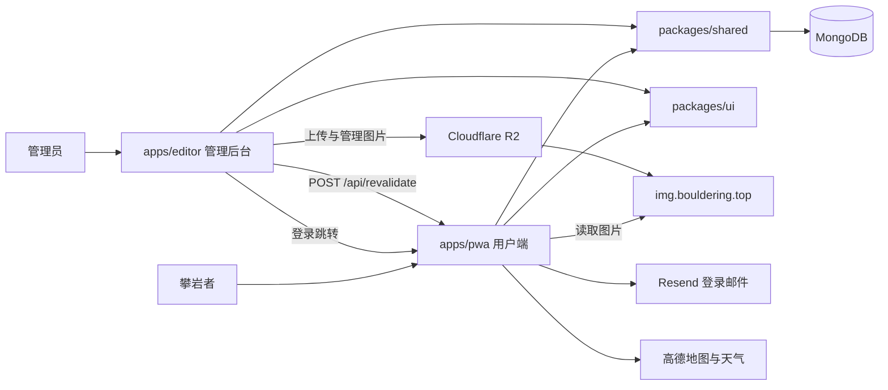
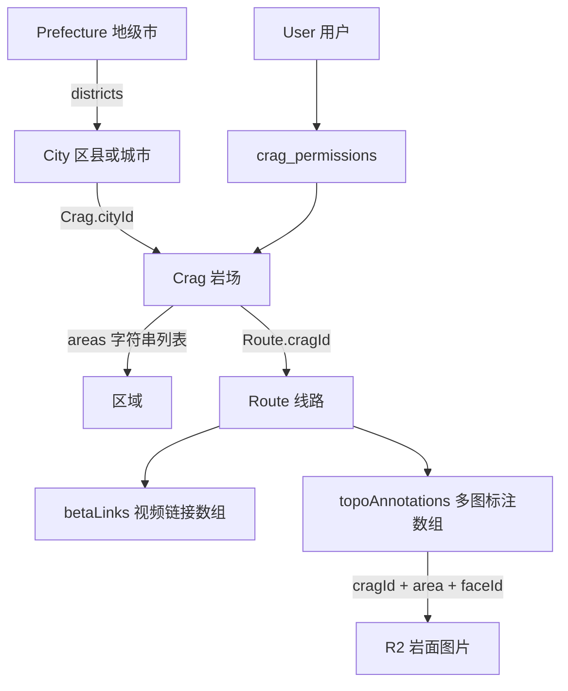

# 技术架构

> 架构基线核对于 2026-09-20，认证、内容一致性、离线与构建边界于 2026-10-02 更新。描述当前源码；部署和验收状态见 [产品迭代记录](PRODUCT.md)。阅读入口：[README](../README.md)。

## 1. 应用边界

BlocTop 是 pnpm + Turborepo monorepo，包含两个独立的 Next.js App Router 应用和两个源码共享包。


```mermaid
flowchart LR
  Visitor[攀岩者] --> PWA[apps/pwa 用户端]
  Staff[管理员] --> Editor[apps/editor 管理后台]
  Editor -->|登录跳转| PWA
  PWA --> Shared[packages/shared]
  Editor --> Shared
  Shared --> DB[(MongoDB)]
  PWA --> UI[packages/ui]
  Editor --> UI
  Editor -->|上传与管理图片| R2[Cloudflare R2]
  PWA -->|读取图片| CDN[img.bouldering.top]
  R2 --> CDN
  Editor -->|POST /api/revalidate| PWA
  PWA --> Mail[Resend 登录邮件]
  PWA --> Map[高德地图与天气]
```

两个应用都包含服务端代码：Server Components、Route Handlers、认证实例。PWA 不通过 Editor 获取公开数据，Editor 也不通过 PWA 写业务数据库。跨应用 HTTP 调用主要用于登录跳转和缓存重验证。

| Workspace | 职责与依赖边界 |
| --- | --- |
| `@bloctop/pwa` | 三语路由、浏览/账号/离线体验、公开与用户 API；目前仍保留部分管理 API |
| `@bloctop/editor` | 中文后台、内容维护、权限管理、独立 API 与动态页面保护 |
| `@bloctop/shared` | 类型、数据访问、鉴权工厂、权限查询、纯工具、日志；含服务端模块，并非全部浏览器安全 |
| `@bloctop/ui` | React UI、IME 输入、Drawer、图片查看器、FaceImageCache、主题 CSS |

共享包直接导出 TypeScript 源码，没有独立构建脚本。Editor 的 Next 配置显式 `transpilePackages`；PWA 有部分 `@/lib/*` 和 `@/types` 文件仅转发共享包。新增依赖前区分客户端工具与 `db`、`mongodb`、权限查询等服务端模块。

## 2. 页面与 API 组织

PWA 页面在 `apps/pwa/src/app/[locale]/`，支持 `zh`、`en`、`fr`；路由入口是 `src/proxy.ts`，不是旧文档中的 `middleware.ts`。

主要页面：`/[locale]`、`/crag/[id]`、`/route`、`/profile`、`/login`、`/auth/*`、`/offline/*`（后几项均省略 locale 前缀）。在线线路详情主要通过抽屉展示；当前没有在线 `/[locale]/route/[id]/page.tsx`，离线端有单线路页面。

Editor 页面直接位于 `apps/editor/src/app/`：`/`、`/crags`、`/crags/new`、`/crags/[id]`、`/faces`、`/routes`、`/cities`、`/users`。无 locale 前缀，也没有 `/editor` 前缀。Beta 已合并进 `/routes` 的标签页，不再有独立 `/betas` 页面。岩场详情通过 `cragId` 参数进入指定岩场的岩面/线路工作台，见[后台指南](ADMIN.md)。

两端 `src/app/api/` 存在同名路由，不能把同一路径视为同一份 API。Beta、认证以及岩面/上传通过 shared handler 工厂复用合约，两个应用注入各自依赖。线路 PATCH 共用 Topo 校验与投影，但其他路由仍有重复实现。后台 API 清单及其他差异见[后台指南](ADMIN.md)。

## 3. 数据模型

类型以 [packages/shared/src/types/index.ts](../packages/shared/src/types/index.ts) 为准，持久化主要由 [db/index.ts](../packages/shared/src/db/index.ts) 和各 API 中的直接 MongoDB 操作完成。不是所有写入都经过统一数据访问函数。


```mermaid
flowchart TD
  Prefecture[Prefecture 地级市] -->|districts| City[City 区县或城市]
  City -->|Crag.cityId| Crag[Crag 岩场]
  Crag -->|areas 字符串列表| Area[区域]
  Crag -->|Route.cragId| Route[Route 线路]
  Route --> Beta[betaLinks 视频链接数组]
  Route --> Annotation[topoAnnotations 多图标注数组]
  Annotation -->|cragId + area + faceId| Face[R2 岩面图片]
  User[User 用户] --> Permission[crag_permissions]
  Permission --> Crag
```

| 实体/集合 | 关键约定 |
| --- | --- |
| `cities` / `prefectures` | 配置存在 MongoDB；地级市包含 `districts`、`defaultDistrict`，城市含 `adcode`、`available`、坐标 |
| `crags` | 字符串业务 ID；`cityId`、区域名称数组、坐标、接近路线、封面、致谢、`createdBy` |
| `routes` | 数字业务 ID；归属岩场和区域，难度通常为 V 级；内嵌 Beta 与多图标注 |
| `counters` | `route-id` 原子递增分配线路 ID，删除和插入失败不回收已分配数字 |
| 岩面 | 当前没有独立 `faces` 集合；通过 R2 对象路径和线路引用表达 |
| `crag_permissions` | `{ userId, cragId, role: 'manager', assignedBy, createdAt }`；全局 admin 无须逐岩场授权 |
| `user` / `session` / `account` / `verification` / `passkey` | better-auth 管理的认证集合，单数命名 |
| `avatars` | 用户头像，由 PWA 用户 API 读写 |
| `feedbacks` / `visits` | 用户反馈和访问统计 |

业务数据以字符串或数字存储 MongoDB `_id`，数据层映射为前端 `id`；better-auth 用户 `_id` 是另一种约定，直接查询时应使用 `ObjectId`。数据层的 `toMongoId()` 只是类型断言，不能代替 ObjectId 转换。

区域是名称而非独立 ID。岩面身份应使用 `(cragId, area, faceId)` 组合；修改区域/岩面名称会牵涉对象路径与线路引用。

地图渲染和后台输入按 GCJ-02 坐标使用，项目运行时没有统一 WGS-84 转换。历史 seed 中仍有 WGS-84 注释，不能据此断言所有旧数据都已完成转换。

## 4. 多图 Topo 与图片存储

```ts
interface RouteTopoAnnotation {
  faceId: string
  area: string
  topoLine: { x: number; y: number }[] // 0–1 归一化坐标
  topoTension?: number               // 0–1
}
```

新数据使用 `Route.topoAnnotations`。共享 [face-references.ts](../packages/shared/src/face-references.ts) 统一完整图片身份、新旧读取与局部变换；非空数组优先，否则从旧字段合成单条标注。服务端将数组第一条投影到旧 `faceId`、`faceArea`、`topoLine`、`topoTension`；`faceArea` 缺失时回退线路区域。显式空数组清除兼容标注字段，MongoDB 用 `$unset` 清除值。

岩面改名/删除/清线只处理指定三元身份；同名其他区域和多图的其他标注保留。图片 URL、同岩面线路分组、后台管理和离线 manifest 共用这一身份。两端线路 PATCH 在修改 Topo 时要求 `expectedTopoVersion`：缺失返回 428，版本过期返回 409，并提供当前线路。历史版本视为 0；真实 Topo 变更及岩面引用变换原子递增版本，Beta/普通文字修改不递增。后台保留冲突草稿，不自动改版本重新提交。此协议保护已存在的线路，不能阻止岩面扫描结束后新线路才引用旧图片；仍不是跨 R2/MongoDB 的全局串行化。

曲线实现位于 [topo-utils.ts](../packages/shared/src/topo-utils.ts)：使用 centripetal Catmull–Rom（调用处 α=0.5），归一化点转换到 SVG viewBox 后绘制；`topoTension` 控制平滑程度，1 对应折线。UI 由 TopoPreview、全屏编辑器、PWA 单/多线路叠加层消费。

R2 对象路径：`{cragId}/{area}/{faceId}.jpg`。旧线路图路径仍通过 `getRouteTopoUrl()` 回退支持。URL 生成集中在 [constants.ts](../packages/shared/src/constants.ts)。

必须保留的编码约定：

- R2 `Key` 使用原始 UTF-8 名称；先净化路径片段，不存 percent-encoded key。
- 公共图片 URL 按片段编码；S3 `CopySource` 也按片段编码。
- 对历史编码对象的兼容读取不等于新写入应重复编码。

## 5. 读写链路

### PWA 浏览

Server Component → 共享 DB 函数 → MongoDB → Client Component → 本地筛选/详情抽屉。

首页读取城市选择 Cookie，按区县或地级市加载数据；线路列表优先采用有效岩场链接的所属城市，其次显式城市参数、Cookie。岩场详情按岩场 ID 加载。DB 查询里的 React `cache()` 用于渲染请求中的复用，不能等同于数据库长期缓存。天气等交互数据经 Route Handler 与 SWR 获取。

首页/线路列表先读取请求 Cookie 后才查询数据库，岩场详情明确动态渲染，不在构建时枚举数据库记录。双应用构建无需服务凭据；运行时仍需配置数据库等依赖。

### Editor 保存

Client Component / hook → 同源 Editor API → session 校验 → 岩场权限校验 → MongoDB 或 R2 → 更新本地界面 → 通知 PWA 重验证。

线路工作台以线路集合和选中 ID 为单一数据来源。Beta 更新与线路表单/Topo 草稿独立；慢保存采用服务端持久化基线，同时保留提交后继续输入的草稿和已经完成的 Beta 操作。

跨应用通知由 [revalidate-pwa.ts](../apps/editor/src/lib/revalidate-pwa.ts) 实现：携带 `REVALIDATE_SECRET` 的 Bearer token 调用 PWA `/api/revalidate`。岩场相关帮助函数展开三种语言的岩场页、首页和线路列表页。两端需要配置一致的密钥。

Editor 的通知在响应前等待，最长 3 秒，返回配置缺失、HTTP、超时或网络失败的结果；已核实会重定向的生产 apex 直接规范为 www，其他重定向拒绝并记录。岩场、线路及图片主要写入接口通过 `refreshPending` 区分保存完成与通知失败，后台保留已保存结果并提示稍后核对，不重复写入。城市/地级市等写入同样等待，但尚未全部提供界面级失败标志。没有持久重试队列，也不会主动刷新所有已打开客户端。

两端新建岩场及创建者授权由 [crag-creation.ts](../packages/shared/src/crag-creation.ts) 在同一 MongoDB transaction 内写入；相同创建者和初始字段可按原 ID 重试，其余占用返回冲突。PWA 保留的创建/授权入口采用相同事务与字段/目标存在性政策，控制器仍有重复实现。部署数据库必须支持事务，构建不会执行此服务。线路 ID 计数器首次参考现存最大 ID；无法还原未知历史删除数字。

岩面操作由 [face-management.ts](../packages/shared/src/face-management.ts) 组织 MongoDB 与 R2。改名先条件复制，再改引用，最后清理旧图；删除先清引用再删图。覆盖需检查所得 ETag，使用条件 Put；清 Topo 后上传失败返回部分完成，网络异常明确写入状态不确定。引用变换对 Topo 字段快照做条件更新，保留同时写入的 Beta/文字。成功或不确定写入会更新 `Crag.mediaRevision`，用于离线版本检测。

R2 与 MongoDB 没有跨服务事务或持久恢复日志；HEAD 后删除仍有竞态，R2 Copy 的源与目标条件检查时点也非原子，见 [Cloudflare 说明](https://developers.cloudflare.com/r2/api/s3/extensions/)。部分失败可能留下待清理图片；必须刷新核对，不能把错误响应理解为全部回滚。

## 6. 认证、缓存与部署边界

- 登录在 PWA 完成：Magic Link、密码、Passkey；两端各建 better-auth 实例，共享数据库、session 与签名密钥。
- 两端认证与登录回跳复用 shared 环境配置；localhost 与生产共享会话，独立 Vercel Preview 使用 host-only Cookie，跨 Preview 登录尚未建立。
- 两端认证 GET/POST 由 shared `auth-route` 统一捕获初始化/异步处理错误，所有响应（包括重定向和错误）为 `private, no-store`，保留原 Cookie。
- 两端关闭 session-data Cookie 缓存，写入鉴权显式请求当前 session，旧部署留下的缓存 Cookie 不授权过期 admin 或已撤销 session；账号本地数据和后台入口状态按账户隔离。真实邮件和 Passkey 流程仍需验收。
- PWA 使用仓库内附许可的本地字体，不在构建时向 Google Fonts 请求。
- 全局角色是 `admin | user`；`manager` 是岩场授权，不是第三种全局角色。服务端 API 才是写入权限边界，详见[认证文档](AUTH.md)。
- 缓存分为 Next 页面/路由缓存、HTTP 缓存、Service Worker、FaceImageCache 内存版本、IndexedDB 离线资料，详见[PWA 文档](PWA.md)。单一失效操作不能刷新所有层。
- PWA 构建使用 webpack 以生成 Serwist Service Worker；开发模式使用 Turbopack 且关闭 SW。Editor 构建使用默认 `next build`。
- 代码默认域名是 `bouldering.top`、`editor.bouldering.top`、`img.bouldering.top`，并按 Vercel 部署场景编写。2026-10-02 已只读核对两端 Vercel 正式部署、Node 24 配置及生产 Beta/Mongo；未进行真实 R2 写入或完整账号流程验收。
- 仓库提供 `/api/mobile/sync`，全量返回岩场和线路，响应缓存一天；`lastUpdated` 是响应生成时间，不是可靠的增量同步游标。本仓库没有原生 iOS 应用代码。

## 7. 修改时应同时检查的范围

| 修改内容 | 联动检查 |
| --- | --- |
| Route 字段/Topo 数据 | shared 类型与 DB、两端 API、Editor hook、PWA 抽屉/叠加层、离线数据、mobile sync |
| 岩面或区域名称 | R2 Key、三元身份匹配、所有 annotations、旧字段、图片 URL 版本 |
| 城市/地级市 | MongoDB 配置、Cookie 解析、首页/线路列表范围、天气 adcode |
| 权限或 session | 两端 auth、共享权限函数、API、列表过滤、角色缓存 |
| 写入与发布 | 当前应用刷新、PWA webhook、浏览器缓存、离线资料更新提示 |

后续优先处理后台，具体任务起点和验证边界见[ADMIN.md](ADMIN.md)。
